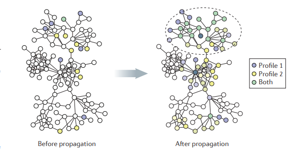

<h1 align="center">
  <br>
  <a href="https://github.com/barakolo/dygraph">
    </a>
  <br>
</h1>

<h4 align="center">Dynamic Network Propagation Algorithm</h4>
<p align="center">
  Dynamic Algorithm for vertex removals in biological networks.
  Implemented in C++, ready to deploy and tested either in Linux/Windows environments.
</p>
<br>

## Introduction
Network propagation has become a central technique in biology, as in other domains, to rank the relevance of genes to a process under investigation. However, its complexity is becoming a bottleneck in dynamic settings where the network is subjected to multiple changes. 
In the biological domain, dynamic computations are essential not only because the network is updated with time but also because certain applications involve the systematic evaluation of propagation results under many network modifications.

Presenting here, for the first time, a dynamic version for this algorithm (under symmetric normalization over the edges, i.e: dividing each edge by the squared-product of the weighted degrees of the corresponding nodes).

## Usage
The library is easy to use. Just compile the given files and you're good to go!
The main.cpp is an example file of usage.
The makefile contains an example for compiling the tests executable.

### Simple propagation
```
double* scores = new double[GENES_COUNT]();
node_map nm = parse_graph(GRAPH_PATH);
DyGraph g(nm);

list<Node*> prior;
prior.push_back(nm[HD_GENE_INDEX]);

g.set_prior(prior);
g.propagate(scores);
```

### Dynamic removals
Assume g is the current DyGraph object. then:
```
double* scores = new double[GENES_COUNT]();
g.del_node(i, scores);
```
This will remove the i'th node and re-calculate the propagation values into scores.

### Input graphs
GRAPH_PATH should refer to graph should be parsed and used.
syntax is csv-file where each-row represents an edge, e.g:
Gene1_NAME\tGene1_ID\tGene2_NAME\tGene2_ID\tEdge_Weight\tComment
Gene123_NAME\tGene123_ID\tGene21_NAME\tGene21_ID\tEdge_Weight\tComment
...

### Various Updates
As for May 18', it's best to use the linux version and compile its tests.cpp.
Use input graphs as wanted.
